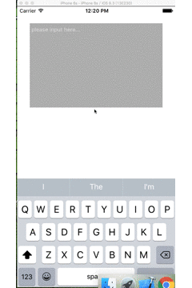

# PINTextView

给UITextView添加placeholder属性,

首先来看一下 .h 文件, 添加的属性如下
```
@property (nonatomic, strong) NSString *placeholder;
@property (nonatomic, strong) UIFont *placeholderFont;
@property (nonatomic, strong) UIColor *placeholderColor;
```

使用方法
```
self.textView = [[PINTextView alloc] init];
_textView.backgroundColor = [UIColor colorWithWhite:0 alpha:0.3];
_textView.frame = CGRectMake(kPadding, 40, kScreenWidth - 2 * kPadding, 200);
[self.view addSubview:_textView];
// 这里设置placeholder
_textView.placeholder = @"please input here...";
_textView.placeholderFont = [UIFont systemFontOfSize:13];
_textView.placeholderColor = [UIColor lightTextColor];

```

最后献上Demo样式：

